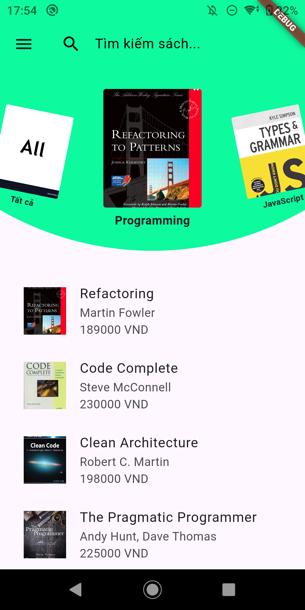
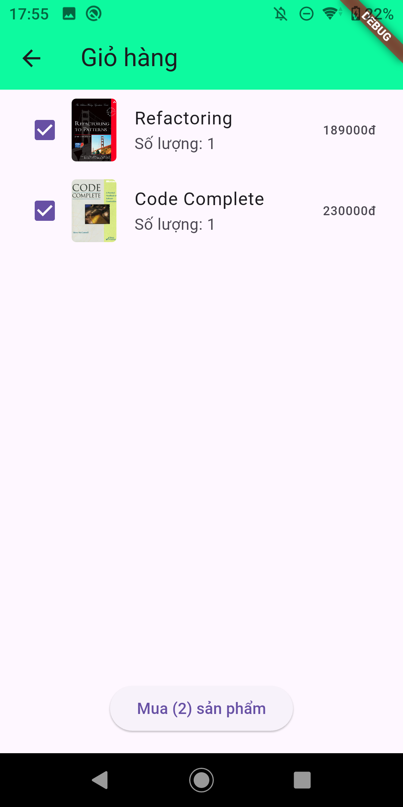

# 📚 Ứng Dụng Bán Sách - Flutter

Một ứng dụng di động được xây dựng bằng Flutter cho phép người dùng duyệt, tìm kiếm, mua sách và quản lý đơn hàng. Dự án phù hợp cho các bạn học lập trình mobile hoặc triển khai ứng dụng thương mại điện tử đơn giản.

## 🚀 Tính Năng Chính

- 🔍 Tìm kiếm sách theo tên, thể loại, tác giả
- 🛒 Thêm vào giỏ hàng và đặt mua sách
- 👤 Đăng ký, đăng nhập, xác thực người dùng
- 📦 Xem lịch sử đơn hàng
- 📄 Trang chi tiết sách kèm mô tả, giá và ảnh bìa

## 🛠️ Công Nghệ Sử Dụng

- **Flutter** (Frontend)
- **Dart**
- **Provider**
- **REST API (NestJS)** (Backend)

## 📸 Ảnh Màn Hình (tuỳ chọn)

| Trang Chủ | Chi Tiết Sách | Giỏ Hàng | Tài Khoản |
|----------|---------------|----------|-----------|
|  |  |  |  |

## 📦 Cài Đặt

### 1. Clone Repo
```bash
git clone https://github.com/phamdanhhuong/book_store_flutter.git

